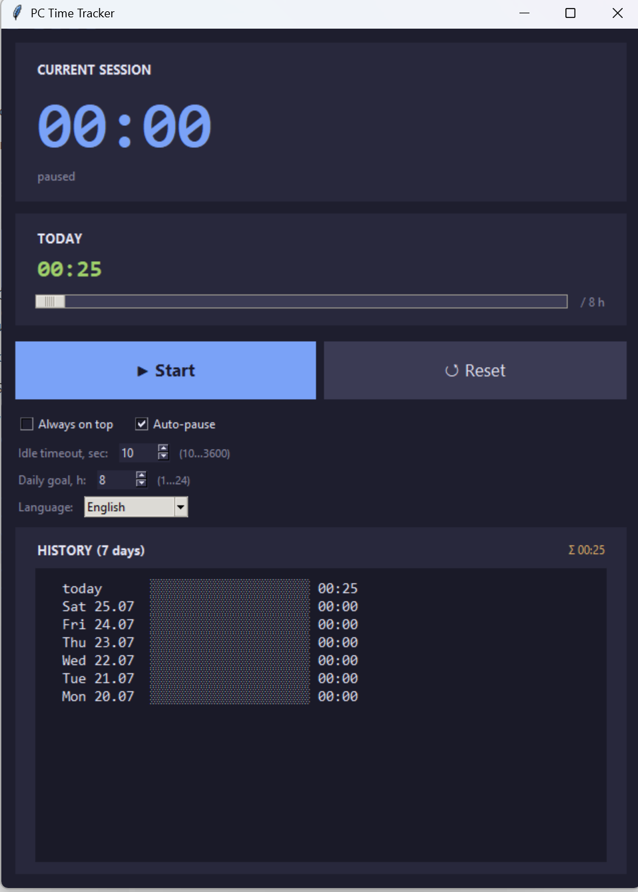

# PC Time Tracker

Lightweight desktop time tracker for Windows. Counts how long you spend at the PC, with auto-pause on idle, configurable daily goal, and 7-day history.


## Features

- 🕒 Big current-session timer + daily total
- ⏸ **Start / Pause / Reset** buttons
- 😴 **Auto-pause** on idle — threshold adjustable (10…3600 sec)
- 🎯 Configurable **daily goal** (1–24 h) with a progress bar
- 📊 **7-day history** with progress bars per day
- 🪟 "Always on top" toggle
- 💾 Auto-save every 10 seconds and on close — sessions survive a reboot
- 🎨 Dark theme, Consolas/Segoe UI fonts
- 🌐 **10 UI languages** — English (default), Русский, 中文, Español, Français, Deutsch, Português, 日本語, 한국어, العربية

## Screenshot



## Install & Run

Requires **Python 3.10+** with the `tkinter` module (included by default on Windows).

```bash
python pc_time_tracker.py
```

Double-click works too, if `.py` is associated with Python.

## Where data is stored

All settings and history live in a single JSON file:

```
%APPDATA%\PCTimeTracker\data.json
```

## License

MIT
