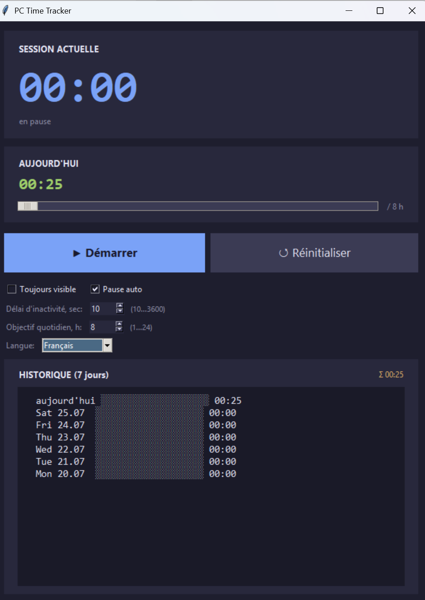

# PC Time Tracker

Chronomètre de bureau léger pour Windows. Compte le temps passé devant l'ordinateur, avec mise en pause automatique en cas d'inactivité, objectif quotidien configurable et historique sur 7 jours.


## Fonctionnalités

- 🕒 Grand chronomètre de la session en cours + total du jour
- ⏸ Boutons **Démarrer / Pause / Réinitialiser**
- 😴 **Pause automatique** en cas d'inactivité — seuil réglable (10…3600 s)
- 🎯 **Objectif quotidien** configurable (1–24 h) avec barre de progression
- 📊 **Historique sur 7 jours** avec barres de progression par jour
- 🪟 Option « Toujours au-dessus »
- 💾 Sauvegarde automatique toutes les 10 secondes et à la fermeture — les sessions survivent à un redémarrage
- 🎨 Thème sombre, polices Consolas / Segoe UI
- 🌐 **10 langues d'interface** — [English (default)](./README.md), [Русский](./ru.md), [中文](./zh.md), [Español](./es.md), [Français](./fr.md), [Deutsch](./de.md), [Português](./pt.md), [日本語](./ja.md), [한국어](./ko.md), [العربية](./ar.md)

## Capture d'écran



## Installation et lancement

Nécessite **Python 3.10+** avec le module `tkinter` (inclus par défaut sous Windows).

```bash
python src/pc_time_tracker.py
```

Un double-clic fonctionne aussi, si l'extension `.py` est associée à Python.

## Où sont stockées les données

Tous les paramètres et l'historique sont conservés dans un seul fichier JSON :

```
%APPDATA%\PCTimeTracker\data.json
```

## Licence

MIT
