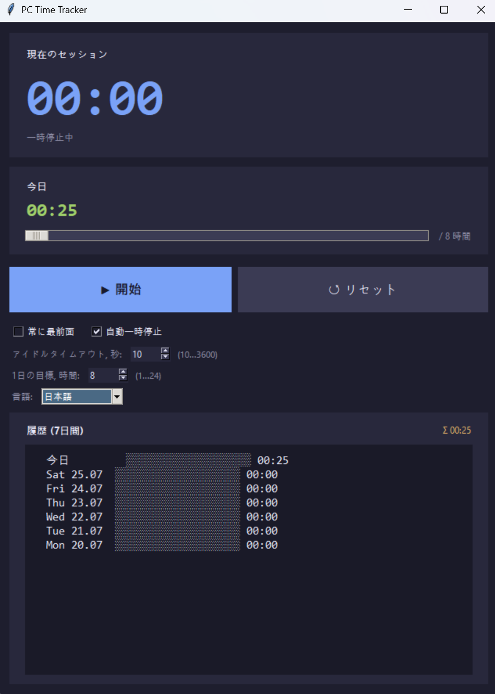

# PC Time Tracker

Windows 向けの軽量なデスクトップ利用時間トラッカー。PC の使用時間を計測し、アイドル時の自動一時停止や設定可能な一日の目標、7 日間の履歴機能を備えています。


## 主な機能

- 🕒 大きな現在のセッションタイマー + 当日の合計時間
- ⏸ **開始 / 一時停止 / リセット** ボタン
- 😴 アイドル時の**自動一時停止** — しきい値は 10〜3600 秒で調整可能
- 🎯 設定可能な**一日の目標**(1〜24 時間)、プログレスバー付き
- 📊 **過去 7 日間の履歴**、日ごとのプログレスバー付き
- 🪟 「常に最前面に表示」トグル
- 💾 10 秒ごと、および終了時に自動保存 — 再起動後もセッションが復元されます
- 🎨 ダークテーマ、Consolas / Segoe UI フォントを採用
- 🌐 **10 言語の UI** — English(デフォルト)、Русский、中文、Español、Français、Deutsch、Português、日本語、韓国語、العربية

## スクリーンショット



## インストールと実行

**Python 3.10+** と `tkinter` モジュールが必要です(Windows では標準で同梱されています)。

```bash
python pc_time_tracker.py
```

`.py` が Python に関連付けられていれば、ダブルクリックでも起動できます。

## データの保存場所

すべての設定と履歴は 1 つの JSON ファイルに保存されます:

```
%APPDATA%\PCTimeTracker\data.json
```

## ライセンス

MIT
