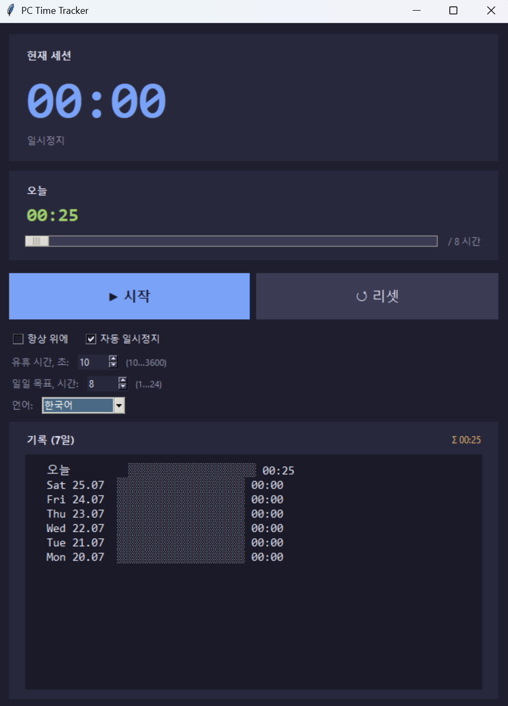

# PC Time Tracker

Windows 용 가벼운 데스크톱 사용 시간 추적기. PC 앞에서 보낸 시간을 측정하며, 유휴 상태 자동 일시정지, 설정 가능한 일일 목표, 7 일간 기록 기능을 제공합니다.


## 주요 기능

- 🕒 현재 세션 타이머 + 오늘의 총 사용 시간
- ⏸ **시작 / 일시정지 / 초기화** 버튼
- 😴 유휴 상태 시 **자동 일시정지** — 임계값 조정 가능 (10…3600 초)
- 🎯 설정 가능한 **일일 목표** (1–24 시간), 진행률 표시줄 포함
- 📊 **7 일간 기록**, 날짜별 진행률 표시줄 표시
- 🪟 "항상 위에" 토글
- 💾 10 초마다 그리고 종료 시 자동 저장 — 재부팅 후에도 세션이 복원됩니다
- 🎨 다크 테마, Consolas / Segoe UI 폰트 사용
- 🌐 **10 개 UI 언어** — English (기본값), Русский, 中文, Español, Français, Deutsch, Português, 日本語, 한국어, العربية

## 스크린샷



## 설치 및 실행

**Python 3.10+** 과 `tkinter` 모듈이 필요합니다 (Windows 에서는 기본적으로 포함되어 있습니다).

```bash
python pc_time_tracker.py
```

`.py` 가 Python 과 연결되어 있다면 더블 클릭으로도 실행할 수 있습니다.

## 데이터 저장 위치

모든 설정과 기록은 단일 JSON 파일에 저장됩니다:

```
%APPDATA%\PCTimeTracker\data.json
```

## 라이선스

MIT
