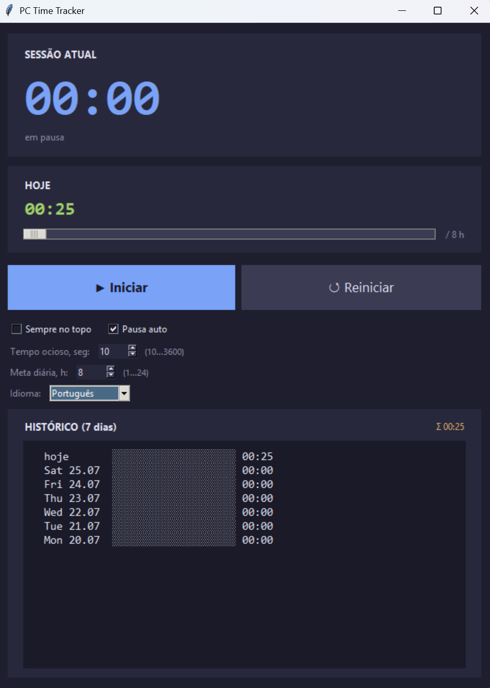

# PC Time Tracker

Cronômetro de tempo de uso leve para Windows. Conta quanto tempo você passa no PC, com pausa automática por inatividade, meta diária configurável e histórico de 7 dias.


## Funcionalidades

- 🕒 Grande cronômetro da sessão atual + total do dia
- ⏸ Botões **Iniciar / Pausar / Zerar**
- 😴 **Pausa automática** por inatividade — limite ajustável (10…3600 s)
- 🎯 **Meta diária** configurável (1–24 h) com barra de progresso
- 📊 **Histórico de 7 dias** com barras de progresso por dia
- 🪟 Opção "Sempre no topo"
- 💾 Salvamento automático a cada 10 segundos e ao fechar — as sessões sobrevivem a uma reinicialização
- 🎨 Tema escuro, fontes Consolas / Segoe UI
- 🌐 **10 idiomas de interface** — English (padrão), Русский, 中文, Español, Français, Deutsch, Português, 日本語, 한국어, العربية

## Captura de tela



## Instalação e execução

Requer **Python 3.10+** com o módulo `tkinter` (já incluído por padrão no Windows).

```bash
python pc_time_tracker.py
```

Um duplo clique também funciona, se `.py` estiver associado ao Python.

## Onde os dados são armazenados

Todas as configurações e o histórico ficam em um único arquivo JSON:

```
%APPDATA%\PCTimeTracker\data.json
```

## Licença

MIT
