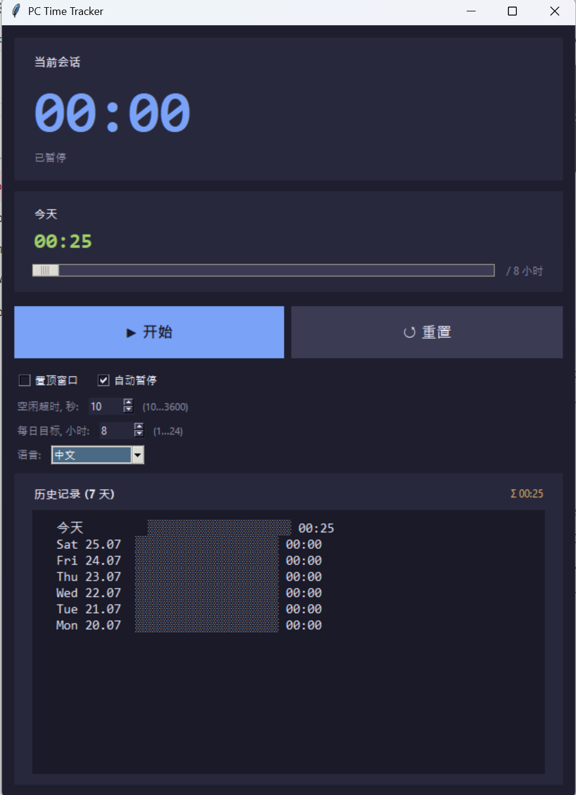

# PC Time Tracker

轻量级 Windows 桌面使用时间追踪器。统计您在电脑前花费的时间,支持空闲自动暂停、可配置的每日目标以及最近 7 天的历史记录。


## 功能特性

- 🕒 大字号当前会话计时器 + 当日总计
- ⏸ **开始 / 暂停 / 重置** 按钮
- 😴 空闲时**自动暂停** — 阈值可调(10…3600 秒)
- 🎯 可配置的**每日目标**(1–24 小时),带进度条
- 📊 **最近 7 天历史记录**,每天的进度条一目了然
- 🪟 "总在最前" 切换开关
- 💾 每 10 秒以及关闭时自动保存 — 重启后会话不丢失
- 🎨 暗色主题,Consolas / Segoe UI 字体
- 🌐 **10 种界面语言** — English(默认)、Русский、中文、Español、Français、Deutsch、Português、日本語、한국어、العربية

## 界面截图



## 安装与运行

需要 **Python 3.10+** 以及 `tkinter` 模块(Windows 上默认自带)。

```bash
python pc_time_tracker.py
```

如果系统已将 `.py` 关联到 Python,直接双击脚本也可以运行。

## 数据存储位置

所有设置和历史记录都保存在一个 JSON 文件中:

```
%APPDATA%\PCTimeTracker\data.json
```

## 许可证

MIT
